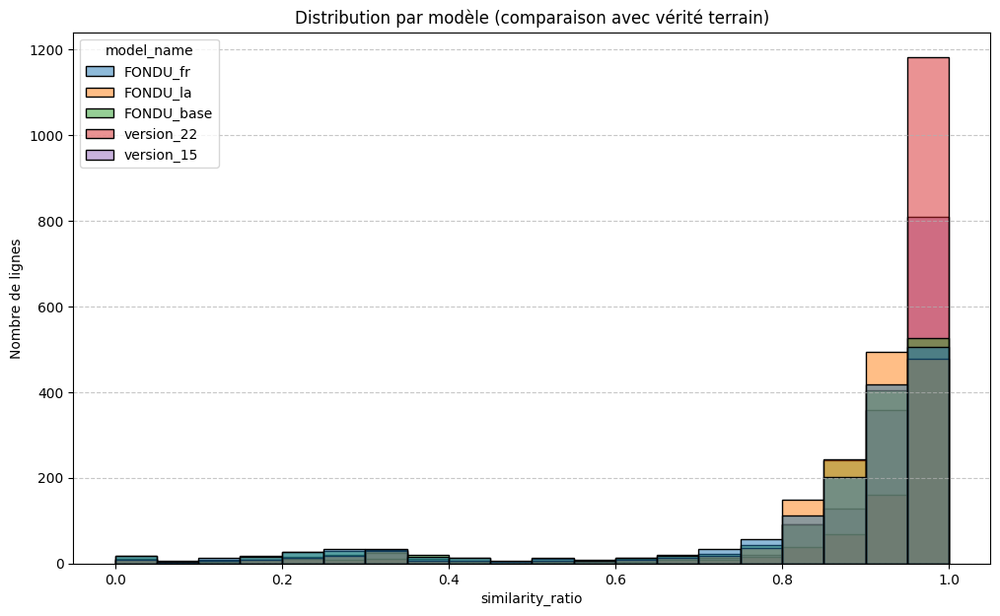
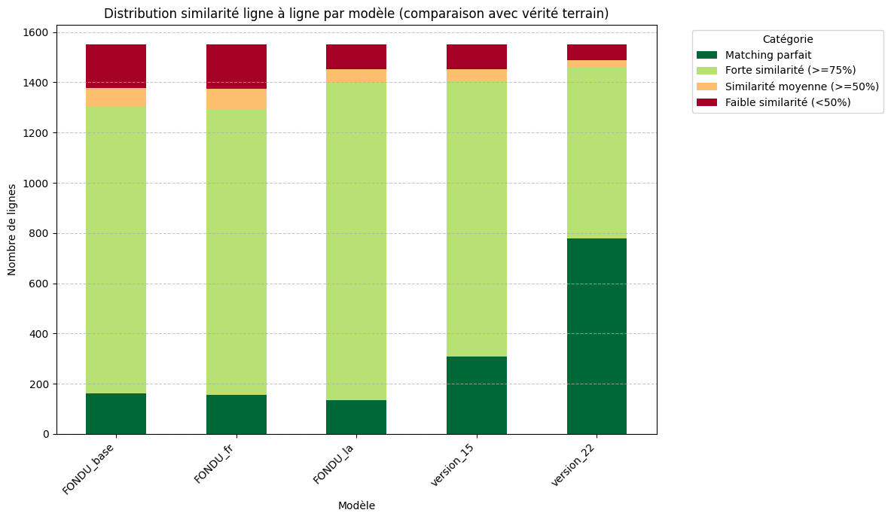
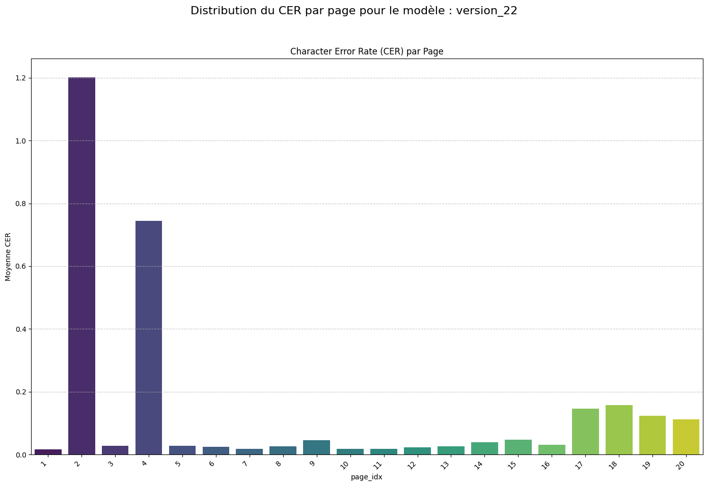

# Installation

Pour éviter tout soucis d'installation (pour les utilisateurs Windows ou de certaines distributions Linux), on fournit un [notebook Colab](https://colab.research.google.com/drive/1dMvd0vr-Owg6MUeVhxWr2EylcE6RZSAg?usp=sharing) (exécutable à condition de disposer d'un compte Google). Autrement, on se réfère à la procédure d'installation décrite par Denisa Bumba sur [gitlab](https://gitlab.com/eman8/scripts/scripts-pour-le-pretraitement-des-corpus-sur-EMAN/gestion_resultats_htr-ocr/-/tree/main/eScriptorium_postprocessing_pipeline?ref_type=heads).

# Rapides rappels des résultats des précédentes campagnes d'évaluations

Pour une description exhaustive et schématique de la chaîne de traitement, on consultera avec profit [la pipeline datée du 13 janvier 2026](https://groupes.renater.fr/wiki/eman/_media/prive/htrleibniz/pipeline_leibniz_13-01-2026.pdf) et, plus généralement, [les carnets de tests suivants](https://groupes.renater.fr/wiki/eman/prive/htrleibniz/chaine_de_traitement_pour_l_augmentation_de_la_verite_terrain_et_l_amelioration_des_modeles_htr). Pour des ressources complémentaires, cf. la page sur le [wiki Renater](https://groupes.renater.fr/wiki/eman/prive/htrleibniz/ressources). Dans ce document, on ne s'intéresse qu'à la partie HTR (et très légèrement à la partie HMER ci-après).

Bien que des résultats assez impressionnants aient pu être obtenus avec des grands modèles de langue généralistes (avec Claude dernier du nom (juin 2026) par Matthew McMillan, Qwen 3.7 plus...), la priorité est donnée à de _petits_ modèles spécialisés (Kraken, FoNDUE-GD) finetunés ou non. Une première étape de segmentation est nécessaire, elle est suivie d'une étape de transcription par ces modèles (présentés ci-après). On procède classiquement en évaluant le résultat d'un modèle contre une vérité de terrain produite spécialement pour l'occasion et vérifiée (voir ci-après l'annexe _Corpus : vérité de terrain certifiée_ pour avoir accès à quelques unes des pages utilisées comme vérité de terrain; de surcroît, un millier de pages supplémentaires pourraient être obtenues si un bon algorithme d'alignement est mis en place; voir les [protocoles de transcription](https://groupes.renater.fr/wiki/eman/prive/htrleibniz/principes_de_relecture_03-12-2025)). Des [statistiques des donneés de terrain](https://groupes.renater.fr/wiki/eman/prive/htrleibniz/statistiques_de_la_verite_de_terrain) sont disponibles.

De plus, un module de calcul de CER/WER a été fait par D.-F. Bumba et intégré dans `eScriptorium_postprocessing_pipeline` (présenté dans la partie installation ci-avant) utilisant `tecquel` et `pywer`.

# Quels modèles évaluer ?
1. FoNDUE-GD_v2.mlmodel = modèle entraîné sur l'ensemble des langues
2. FoNDUE-GD_v2_fr.mlmodel = il s'agit du modèle FoNDUE-GD_v2.mlmodel fine-tuné sur des textes en français
3. FoNDUE-GD_v2_la.mlmodel = il s'agit du modèle FoNDUE-GD_v2.mlmodel fine-tuné sur des textes en latin
4. version_15
5. version_22
6. german_handwriting_fine-tune_BerlinGT_v1.2 (peut être exclus, considéré comme sous-performant; mais corrigé & utilisé pour la vérité terrain).

À cela s'ajoutent deux fine-tuning produits par D.-F. Bumba lors da la fin du mois de juin. Leurs performances semblent néanmoins, au premier coup d'oeil, bien inférieures à ce dont nous disposions précedemment. De plus, parallèlement à ces modèles _lightweights_, de rapides tests employant des vLLM ont été conduits.
Noter que pour chacun des tests, la segmentation est réputée être de confiance (et elle l'est pour les corpus utilisés). Le corpus étalon évalué sont le `corpus_french_leibniz` ainsi que la vérité terrain produite au cours du mois de juin (pour un total de 30 à 40 pages).

# Ré-évaluation des modèles, détections d'aberrations (scores faussés)

Pour chacun des cinq modèles retenus, on commence par évaluer grossièrement le CER en cherchant à déterminer si le modèle a tendance à se tromper ou pas et dans quelle mesure ? On affinera par la suite on cherchant plus précisément le type d'erreurs commises par le modèle.

Les modèles 15 et 22 semblent se démarquer, les bons résultats du modèle 22 sont néanmoins obtenus au prix d'un _trop_ grand nombre d'erreurs, comme on le voit plus précisément sur le graphique ci-dessous.

Toutefois, peut-on avoir véritablement foi en les valeurs prédites sur le jeu d'évaluation ? N'y-a-t'il pas des résultats complètement aberrants qui viennent fausser le résultat ? Pour se rendre compte que c'est le cas, on peut changer d'échelle : si précédemment les mesures étaient faites en agregeant toutes les pages ensemble (puis en prenant la moyenne), il suffit de regarder page par page le résultat obtenu. Il est également possible d'aller plus en détail : ligne par ligne. Tout d'abord, au niveau de la page, pour le modèle 22 (par exemple), on détecte 2 pages avec des mesures anormales (tout du moins, un examen humain des pages ne permet pas de justifier des résultats aussi mauvais) :

En regardant plus en détail, sur la première partie de la page 2, on peut constater les insertions (vert) et déletions (rouge) suivantes : 

  **GT Version** | **version_22** |
 |----------------|----------------|
 | _  , [[alors son expression]] | ⟦                                       ⟧ |
 | [[pour estre]] pour marquer que le signe de p. ou q premier | ⟦      ⟧ pour marquer que le signe de p. ou q premier |
 | ou second de la 4me equation depend en quelques façon du Signe dé | ou second de la 4me equation depend en quelque façon du signe de |
 | K, ou l, qui est le deuxiesme de la 3me equation. Et | K, ou l, qui est le deuxiesme de la 3me equation. Et |
 | enfin je trouve bon de fermer ces parentheses par en haut pour | enfin je trouve bon de fermer les parentheses par en haut pour |
 | les discerner de quelques autres parentheses dont on peut avoir | les discerner de quelques autres parentheses dont on peut avoir |
 | besoin. On voit par la l'advantage assez considerable | besoin. On voit par la l'advantage assez considerable |
 | de cette façon des signes sur la premiere qui est de n'estre pas | de cette façon des signes sur la premiere qui est de n'estre pas |
 | obligé d'en faire des nouveaux qui sont quelques fois fort | obligé d'en faire des nouveaux qui sont quelques fois fort |
 | composés, et ennuyeux: mais en recompense il faut bien | composés, et ennuyeux: mais en recompense il faut bien |
 | souvent recourir à la liste generale, ou table des Ambiguitez | souvent recourir à la liste generale, ou table des Ambiguitez |
 | pour avoir leur explication au bout du conte, et pour essayer | pour avoir leur explication au bout du conte, et pour essayer |
 | mestre pendant l'operation si plusieurs signes correspondants | mesme pendant l'operation si plusieurs signes correspondants joints |
 | ensemble ne se destruisent peut estre, ou s'expliquent points | ensemble ne se destruisent peut estre, ou s'expliquent |
 | mutuellement comme cela arrive quelques fois au lieu | mutuellement comme cela arrive quelques fois au lieu |
 | que les autres se déchiffrent eux mesmes, à la premiere veüe | que les autres se déchiffrent eux mesmes, à la premiere veüe |

L'essentiel des éléments perturbateurs est concentré sur les premières lignes et correspond (presque majoritairement) à du texte barré ou raturé. Il est clair que pour une transcription diplomatique, un tel résultat d'HTR est trop faible. En revanche, pour une recherche (RAG etc.), le taux d'erreur est tout à fait acceptable.

# Détection et identification des erreurs produites par les modèles

<!-- https://groupes.renater.fr/wiki/eman/prive/htrleibniz/symboles_speciaux_vols_vi_viii -->
<!-- https://groupes.renater.fr/wiki/eman/prive/htrleibniz/observations_corrections_alignements -->

# Reconstruction textuelle à partir de plusieurs transcriptions, _take the best leave the worst_

# Quelques compléments LLM et vLLM

Pour quelques réflexions collectives sur l'apport de Claude, on pourra notamment consulter les ébauches de réponse à une initiative de Matthew McMillan ci-dessous (en annexe).

# Quelques tests d'alignement

L'objectif des travaux d'alignement est le suivant : étant donné que l'on dispose d'un PDF contenant une transcription (avec apparat critique) réalisé par des experts, il est souhaitable de pouvoir réutiliser ce travail en le calquant ligne à ligne sur (environ?) un millier de folios. Ainsi, on récupérerait un millier de pages de vérité de terrain. Pour ce faire, la stratégie est la suivante (étant donné que les textes ne sont pas déjà alignés (même faiblement)) : générer une transcription automatique avec un modèle présentant un niveau de confiance suffisant, calculer les appariements textuels pour pouvoir remplacer (lorsque c'est nécessaire) la transcription générée de la ligne par la vérité de terrain.

Les grands essais d'alignement se sont fondés sur [passim](https://github.com/dasmiq/passim). D'autres essais ont été faits en réemployant et détournant l'utilisation de `sentence-transformers/all-MiniLM-L6-v2`. Les résultats ne sont pas concluants quoiqu'ils restent encourageants.

TESTS ENCORE À FAIRE!!!!

# Annexes 

## Corpus (vérité de terrain certifiée)

Version au 29 juin 2026.

| Date | column_2 | Source | Segmentation corrected | N image | Author | Difficulty level | Time for correction | Base model | Annotation notes | Alignement | Author_2 | Language | HTR corrected | Difficulty level_2 | Time for HTR text correction | HTR model or ALIGN | Correction notes |
| --- | --- | --- | --- | --- | --- | --- | --- | --- | --- | --- | --- | --- | --- | --- | --- | --- | --- |
|  | VI-4 | Test modèle "blla" sur des échantillons de Leibniz |  |  |  |  |  |  |  |  |  |  |  |  |  |  |  |
| 07-01-2026 |  | LH_1_2_1 | LH_1_2_1_0004r.jpg | 1 | Denisa | Easy | 40-50 min | blla.mlmodel |  | Yes | Denisa | lat | Yes | Difficult | 1h10 | passim_best |  |
|  |  |  | LH_1_2_1_0004v.jpg | 2 | Denisa | Easy | 40-50 min | blla.mlmodel |  | Yes |  |  |  |  |  | passim_best |  |
|  |  |  | LH_1_2_1_0005r.jpg | 3 | Denisa | Easy | 40-50 min | blla.mlmodel |  | Yes |  |  |  |  |  | passim_best |  |
|  |  |  | LH_1_2_1_0027r.jpg | 5 | Denisa | Difficult | 50-60 min | blla.mlmodel |  | Yes |  |  |  |  |  | passim_best |  |
|  |  | LH_1_3_4 | LH_1_3_4_0011r-0010v.jpg | 9 | Denisa | Easy | 40 min | blla.mlmodel |  | Yes |  |  |  |  |  | passim_best |  |
|  |  | LH_4_6_12a | LH_4_6_12a_0001v.jpg | 37 | Denisa | Easy | 30 min | blla.mlmodel |  | Yes |  |  |  |  |  | passim_best |  |
|  |  | Fine-tuning "test-train-1" model |  |  |  |  |  |  |  |  |  |  |  |  |  |  |  |
| 08-01-2026 |  | Test modèle "test-train-1" sur des échantillons similaires |  |  |  |  |  |  |  |  |  |  |  |  |  |  |  |
|  |  | LH_1_2_1 | LH_1_2_1_0025r-0024v.jpg | 4 | Denisa | Difficult | 27 min | test-train-1.mlmodel | double page,additions | Yes |  |  |  |  |  | passim_best |  |
|  |  | LH_1_3_1 | LH_1_3_1_0008v-0007r.jpg | 7 | Denisa | Very difficult | 50 min | test-train-1.mlmodel | double page, additions, lines span over the margin zone, zones difficult to correct | Yes | Audrey | fr |  |  |  | passim_best |  |
|  |  | LH_1_3_4 | LH_1_3_4_0008r-0007v.jpg | 8 | Denisa | Easy | 30 min | test-train-1.mlmodel | double page, lines tend to go up and down, difficult to have a straight line | Yes | Denisa | lat | Yes | Difficult | ? | passim_best |  |
|  |  | LH_1_3_5 | LH_1_3_5_0024v-0023r.jpg | 10 | Denisa | Easy | 20 min | test-train-1.mlmodel | double page, margin notes, cleaner format | Yes | Sébastien | fr |  |  |  | passim_best |  |
|  |  | LH_1_3_7_A | LH_1_3_7_A_0004v-0003r.jpg | 11 | Denisa | Easy | 8 min | blla.mlmodel | double page (left page empty), writing that tends to go slightly up, so the lines are cut in small segments | Yes | Denisa | lat | Yes | Easy | 1h | passim_best | l.52 (il manque le début de la ligne dans l'éd. critique) ; pas sûre d'avoir bien transcrit |
|  |  | LH_1_3_7_D | LH_1_3_7_D_0002v-0001r.jpg | 13 | Denisa | Difficult | 35 min | test-train-1.mlmodel | double page, correcting the zones took more time | Yes |  |  |  |  |  | passim_best |  |
|  |  | LH_1_4_4 | LH_1_4_4_0001v.jpg | 17 | Denisa | Easy | 8 min | test-train-1.mlmodel | simple page, baselines already pretty well detected. Sometimes lines are segmented when the writing goes up a little. | Yes |  |  |  |  |  | passim_best |  |
|  |  | Fine-tuning "test-train-2" model |  |  |  |  |  |  |  |  |  |  |  |  |  |  |  |
|  |  | Test modèle "test-train-2" sur des échantillons similaires |  |  |  |  |  |  |  |  |  |  |  |  |  |  |  |
| 09-01-2026 |  | LH_1_3_1 | LH_1_3_1_0003r-0002v.jpg | 6 | Denisa | Difficult | 37 min | test-train-2.mlmodel | double page, the new model is better at recognising long, tilted lines without spliting them in several segments. I noticed that the model fine-tuned on eScriptorium does not recognise the InterlinearLine type of lines at all... and recognizes less than before. I should test the local fine-tuning and check if adding classes is allowed. | Yes | Audrey | fr | En cours |  |  | align_clean_no_app_lev_0.4 |  |
|  |  | LH_1_3_7_C | LH_1_3_7_C_0001.jpg | 12 | Denisa | Very difficult | 60 min | test-train-2.mlmodel | double page, the zones are almost overlapping. It took time to correct the zones. Many margin notes. | Yes |  |  |  |  |  | passim_best |  |
|  |  | LH_1_4_1 | LH_1_4_1_0001r.jpg | 14 | Denisa | Easy | 10 min | test-train-2.mlmodel | double page, less lines, easy layout. Almost perfect line detection on this page. | Yes | Denisa | lat | Yes | Easy | 1h | passim_best |  |
|  |  | LH_1_4_7 | LH_1_4_7_0015v-0014r.jpg | 20 | Denisa | Very difficult | 63 min | test-train-2.mlmodel | double page, many margin lines, different character sizes. | Yes | Mathias | fr | Yes | Difficult | 2h | passim_best | Problèmes de masks + une partie substantielle de la transcription manquait (faite de zéro) |
|  |  | Fine-tuning "test-train-3" model |  |  |  |  |  |  |  |  |  |  |  |  |  |  |  |
|  |  | Test modèle "test-train-3" sur des échantillons similaires |  |  |  |  |  |  |  |  |  |  |  |  |  |  |  |
| 12-01-2026 |  | LH_1_4_3 | LH_1_4_3_0004r-0003v.jpg | 16 | Denisa | Easy | 20 min | test-train-3.mlmodel | double page, very good segmentation for main lines, less good for the addition lines | Yes |  | lat |  |  |  | passim_best |  |
|  |  |  | LH_1_4_3_0002v-0001r.jpg | 15 | Denisa | Easy | 5 min | test-train-3.mlmodel | double page, almost perfect segmentation (both zones and lines), some addition lines not detected | Yes |  | lat |  |  |  | passim_best |  |
|  |  | LH_1_4_7 | LH_1_4_7_0012v-0011r.jpg | 19 | Denisa | Easy | 7 min | test-train-3.mlmodel | double page, almost perfect, added some missing addition lines | Yes | Florian | fr | Yes | Easy | 1h | passim_best |  |
|  |  | LH_1_4_8 | LH_1_4_8_0016r-0015v.jpg | 21 | Denisa | Easy | 15 min | test-train-3.mlmodel | double page, almost perfect, added some missing addition lines | Yes |  | fr |  |  |  | passim_best |  |
|  |  | LH_1_6_2 | LH_1_6_2_0002v-0001r.jpg | 22 | Denisa | Easy | 10 min | test-train-3.mlmodel | double page, almost perfect, added some missing addition lines | Yes |  | lat |  |  |  | passim_best |  |
|  |  | LH_1_6_4 | LH_1_6_4_0002r-0001v.jpg | 23 | Denisa | Very easy | 5 min | test-train-3.mlmodel | double page, no margin notes, ink with low contrast | Yes |  | fr |  |  |  | passim_best |  |
|  |  | LH_1_6_5 | LH_1_6_5_0002v-0001r.jpg | 24 | Denisa | Very difficult | 14 min | test-train-3.mlmodel | double page, margin note zone as large as main zone on the left page, low contrast ink, uppercase letter that are very large | Yes | Florian | fr | Yes | Very easy | 45mn | passim_best |  |
|  |  | LH_1_6_6 | LH_1_6_6_0002v-0001r.jpg | 25 | Denisa | Very difficult | 45 min | test-train-3.mlmodel | double page, margine note lines very close to the main zone, sometimes overlapping with the main zone. We decided not to cut too much into the mainzone (right page) -> review this decision later. | Yes |  | lat |  |  |  | passim_best |  |
|  |  | Fine-tuning "test-train-4" model |  |  |  |  |  |  |  |  |  |  |  |  |  |  |  |
|  |  | Test modèle "test-train-4" sur des échantillons similaires |  |  |  |  |  |  |  |  |  |  |  |  |  |  |  |
| 13-01-2026 |  | LH_1_6_11 | LH_1_6_11_0002r-0001v.jpg | 26 | Denisa | Easy | 8 min | test-train-4.mlmodel | double page, almost perfect, few lines missed | Yes |  |  |  |  |  | passim_best |  |
|  |  | LH_1_7_5 | LH_1_7_5_0065r-0064v.jpg | 27 | Denisa | Easy | 8 min | test-train-4.mlmodel | double page, almost perfect segmentation, this time we went into details, adjusting the baselines starting with uppercase letter | Yes |  |  |  |  |  | passim_best |  |
|  |  | LH_1_7_6 | LH_1_7_6_0043r-0042v.jpg | 28 | Denisa | Easy | 15 min | test-train-4.mlmodel | double page, very good segmentation, corrected some addition lines and some baselines | Yes |  |  |  |  |  | passim_best |  |
|  |  | LH_1_20 | LH_1_20_0065v-0064r.jpg | 29 | Denisa | Very difficult | 53 min | test-train-4.mlmodel | double page, a lot of margin notes, close to the main zone, and a lot of additions | Yes | Mathias | fr | Yes | Medium | 1h30 | passim_best |  |
| 16-01-2026 |  |  | LH_1_20_0111v-0110r.jpg | 30 | Denisa | Very difficult | 50 min | test-train-4.mlmodel | double page, vertical lines on the margins of the left page | Yes |  |  |  |  |  | passim_best |  |
| 09-02-2026 |  |  | LH_1_20_0164v-0163r.jpg | 31 | Denisa | Easy | 15 min | blla.mlmodel | double page, vertical lines, quotation marks distanced from the text lines, few additions | Yes |  |  |  |  |  | passim_best |  |
|  |  |  | LH_1_20_0287v-0284r.jpg | 32 | Denisa | Easy | 10 min | blla.mlmodel | double page, fade ink | Yes |  |  |  |  |  | passim_best |  |
| 10-02-2026 |  | LH_2_3_1 | LH_2_3_1_0051r-0050v.jpg | 33 | Denisa | Difficult | 25 min | test-train-4.mlmodel | double page, fade ink in some parts, lots of small additions, vertical lines | Yes |  |  |  |  |  | passim_best |  |
|  |  |  | LH_2_3_1_0054r-0053v.jpg | 34 | Denisa | Easy | 15 min | test-train-4.mlmodel | double page, margin notes and small addition lines | Yes |  |  |  |  |  | passim_best |  |
|  |  | Fine-tuning "test-train-5" model (⚠️ this model is a model trained from scratch, we will continue to use test-train-4) |  |  |  |  |  |  |  |  |  |  |  |  |  |  |  |
|  |  | Test modèle "test-train-5" sur des échantillons similaires |  |  |  |  |  |  |  |  |  |  |  |  |  |  |  |
|  |  | LH_2_3_1 | LH_2_3_1_0058r-0057v.jpg | 35 | Denisa | Very difficult | 45 min | test-train-4.mlmodel | double page, very small letters, small addition lines, some zones are difficult to delimitate | Yes |  |  |  |  |  | passim_best |  |
| 12-02-2026 |  | LH_4_1_4d | LH_4_1_4d_0002r-0001v.jpg | 36 | Denisa | Difficult | 12 min | test-train-4.mlmodel | double page, with crossed over lines and additional lines that are illegible | Yes |  |  |  |  |  | passim_best |  |
| 19-02-2026 |  | LH_1_4_7 | LH_1_4_7_0012r-0011v.jpg | 18 | Denisa | Easy | 15 min | test-train-5.mlmodel | double page, part of the text on the first page is erased, small interlinear additions | Yes | Florian | fr | Yes | Medium | 2h | passim_best |  |
| 28-05-2026 |  | LH_1_1_4 | LH_1_1_4_0072r.jpg | 38 | Denisa | Easy | 2 min | blla.mlmodel |  |  |  | lat |  |  |  | passim_best |  |
|  |  | LH_1_2_1 | LH_1_2_1_0001r.jpg | 39 | Denisa | Difficult | 35 min | fine-tuned-model_best | a lot of crossed-over passages that are illegible |  |  | lat |  |  |  | passim_best |  |
|  |  |  | LH_1_2_1_0002r.jpg | 40 | Denisa | Difficult | 28 min | fine-tuned-model_best |  |  |  | lat |  |  |  | passim_best |  |
| 22-06-2026 |  | LH_1_3_1 | LH_1_3_1_0001v.jpg | 93 | Rui |  |  | best_0.4006 |  | Yes | Rui | fr | En cours |  |  | passim_best |  |
|  |  | LH_1_3_1 | LH_1_3_1_0003v-0002r.jpg | 94 | Rui |  |  | best_0.4006 |  |  |  | fr |  |  |  |  |  |
| 10-03-2026 | VIII-1 | LH_4_8 | LH_4_8_0073r-0072v.jpg | 1 | Denisa | Easy | 5 min | test-train-4.mlmodel | double page, few lines | Yes | Denisa | lat, ge | Yes | Easy | 15 min | align_all_lev_0.4 | Did not transcribe lines in German, difficult to make the correspondance. |
|  |  | LH_4_8 | LH_4_8_0073v-0072r.jpg | 2 | Denisa | Very difficult | > 1h | test-train-4.mlmodel | double page, many (long) lines | Yes | Denisa | lat, ge, fr, en | Yes | Very difficult | > 3 hrs | align_all_lev_0.4 | l.32 "machina 1000 tonnen" : not sure of the transcription inside the () l. 285 "[[]] in △  communi crescit injecto certo sale, et" : not sure of the transcription of communi |
|  |  | LH_35_3A | LH_35_3A_8_0027r.jpg | 3 | Denisa | Easy | 15 min | test-train-4.mlmodel | single pages, very segmented lines | Yes | Denisa | fr, ge, lat | Yes | Easy | 30 min | align_clean_lev_0.4 |  |
|  |  | LH_35_5_2 | LH_35_5_2_0006r-0005v.jpg | 5 | Denisa | Very difficult | > 1h | test-train-4.mlmodel | double page, very difficult, with a lot of fractions and mixed of complex and simple maths, many elements of the layout to correct as well, vertical text... | Yes | Denisa | lat | Yes | Very difficult | 4 hrs | passim_best | We did not correct the lines in the margin on the left page, it was too complicated. We will delete all empty lines before training. This pages needs a second review. |
| 11-03-2026 |  |  | LH_35_5_2_0006v-0005r.jpg | 6 | Denisa | Difficult | 40 min | test-train-4.mlmodel | double page, with maths -> review later the segmentation of lines containing fractions | Yes |  | lat |  |  |  | passim_best |  |
|  |  |  | LH_35_5_2_0008r-0007v.jpg | 7 | Denisa | Difficult | 30 min | test-train-4.mlmodel | double page, with maths -> review later the segmentation of lines containing fractions | Yes |  | lat |  |  |  | passim_best |  |
|  |  |  | LH_35_5_2_0008v-0007r.jpg | 8 | Denisa | Easy | 13 min | test-train-4.mlmodel |  | Yes | Denisa | lat | Yes | Easy | 25 min | passim_best | review l.26 (intersection symbol ?) : non, c'est un symbole de la multiplication, il est correct : ⌣ (U+2323) |
|  |  |  | LH_35_5_2_0009r.jpg | 9 | Denisa | Easy | 13 min | test-train-4.mlmodel |  | Yes | Denisa | lat | Yes | Easy | 25 min | passim_best |  |
|  |  | LH_35_12_1 | LH_35_12_1_0327r.jpg | 10 | Denisa | Easy | 15 min | test-train-4.mlmodel |  | Yes | Denisa | lat | Yes | Easy | 30 min | passim_best |  |
|  |  | LH_35_12_2 | LH_35_12_2_0156r-0155v.jpg | 11 | Denisa | Easy | 30 min | test-train-4.mlmodel |  | Yes |  | lat |  |  |  | passim_best |  |
| 12-03-2026 |  |  | LH_35_12_2_0156v-0155r.jpg | 12 | Denisa | Difficult | 40 min | test-train-4.mlmodel | double page, with maths and graphiczones. | Yes |  | lat |  |  |  | passim_best |  |
| 16-03-2026 |  | LH_35_14_2 | LH_35_14_2_0099v-0098r.jpg | 13 | Denisa | Difficult | 45 min | test-train-4.mlmodel | double page, ink with low contrast | Yes | Denisa | lat | Yes | Difficult | > 4 hrs | passim_best | l. 79 abbréviation : contra -> con = 9 ; cette abréaviation revient souvent dans ce texte. reprendre à partir de la l. 101 |
| 17-03-2026 |  |  | LH_35_14_2_0101v-0100r.jpg | 14 | Denisa | Difficult | 1h10 | test-train-4.mlmodel | 4 columns, a lot of lines to correct, low contrast ink | Yes | Denisa | lat | Yes | Difficult | 1h50 | passim_best |  |
|  |  |  | LH_35_14_2_0131v-0130r.jpg | 15 | Denisa | Easy | 22 min | test-train-4.mlmodel |  | Yes | Denisa | lat | Yes | Easy | 30 min | passim_best |  |
|  |  |  | LH_35_14_2_0133v-0132r.jpg | 16 | Denisa | Easy | 35 min | test-train-4.mlmodel |  | Yes | Denisa | lat | Yes | Easy | 1h | passim_best |  |
| 18-03-2026 |  | Fine-tuning "fine-tuned-model_best" model |  |  |  |  |  |  |  |  |  |  |  |  |  |  |  |
|  |  | Test modèle "fine-tuned-model_best" sur des échantillons similaires |  |  |  |  |  |  |  |  |  |  |  |  |  |  |  |
| 23-03-2026 |  | LH_35_14_2 | LH_35_14_2_0134v-0129r.jpg | 17 | Denisa | Easy | 15 min | fine-tuned-model_best |  | Yes | Denisa | lat | Yes | Easy | 1h | passim_best |  |
| 20-04-2026 |  | LH_35_15_1 | LH_35_15_1_0014r.jpg | 18 | Denisa | Easy | 9 min | fine-tuned-model_best | simple page, over segmented baselines | Yes | Audrey | fr | Yes | Easy | 20min | passim_best |  |
|  |  |  | LH_35_15_1_0017r.jpg | 19 | Denisa | Easy | 8 min | fine-tuned-model_best | simple page, over segmented baselines | Yes | Audrey | fr | Yes | Easy |  | passim_best |  |
|  |  | LH_35_15_6 | LH_35_15_6_0021r.jpg | 20 | Denisa | Easy | 7 min | fine-tuned-model_best |  | Yes | Denisa | fr | Yes | Easy | 15 min | passim_best |  |
|  |  |  | LH_35_15_6_0024r.jpg | 21 | Denisa | Easy | 9 min | fine-tuned-model_best |  | Yes | Denisa | lat | Yes | Easy | 1h | passim_best |  |
|  |  |  | LH_35_15_6_0046v.jpg | 22 | Denisa | Difficult | 15 min | fine-tuned-model_best |  | Yes |  | lat |  |  |  | passim_best |  |
| 28-05-2026 |  |  | LH_35_15_6_0048r-0047v.jpg | 23 | Denisa | Easy | 19 min | fine-tuned-model_best |  | Yes | Denisa | lat | Yes | Medium | 2h | passim_best |  |
|  |  |  | LH_35_15_6_0048v-0047r.jpg | 24 | Denisa | Easy | 10 min | fine-tuned-model_best |  | Yes |  |  |  |  |  | passim_best |  |
| 15-06-2026 |  | LH_35_15_6 | LH_35_15_6_0056r.jpg | 31 | Denisa | Easy | 11 min | fine-tuned-model_best | all baselines oversegmented, even with our best segmentation model | Yes |  | lat |  |  |  | passim_best |  |
|  |  |  | LH_35_15_6_0057r.jpg | 32 | Denisa | Easy | 5 min | fine-tuned-model_best |  | Yes |  | lat |  |  |  | passim_best |  |
|  |  |  | LH_35_15_6_0063v.jpg | 34 | Denisa | Easy | 6 min | fine-tuned-model_best |  | Yes |  | lat |  |  |  | passim_best |  |
| 18-06-2026 |  | LH_37_2 | LH_37_2_0101r.jpg | 38 | Denisa | Easy | 25 min | fine-tuned-model_best |  | No |  | lat |  |  |  |  |  |
|  |  | LH_37_4 | LH_37_4_0071r.jpg | 39 | Denisa | Very easy | 12 min | fine-tuned-model_best | /!\ encre qui traverse la page | No |  | lat |  |  |  |  |  |
| 19-06-2026 |  |  | LH_37_4_0071v.jpg | 40 | Denisa | Very easy | 3 min | fine-tuned-model_best | /!\ encre qui traverse la page | No |  | lat |  |  |  |  |  |
|  |  | LH_38 | LH_38_0018v-0017r.jpg | 42 | Denisa | Easy | 20 min | fine-tuned-model_best |  | No |  | lat |  |  |  |  |  |
| 04-06-2026 | Corpus Audrey | LH_35_4_12 | 5r.jpg | 1 | Audrey | Easy | 15 min | fine-tuned-model_best | only the right page | Yes | Audrey | fr | Yes | Very easy |  | passim_best |  |
|  |  | LH_35_4_12 | 9r.jpg | 2 | Audrey | Easy | 30 min | fine-tuned-model_best | simple page | Yes | Audrey | fr | Yes | Easy |  | passim_best |  |
|  |  | LH_35_4_12 | 9v.jpg | 3 | Audrey | Easy | 10 min | fine-tuned-model_best | only the right page | Yes | Audrey | fr | Yes | Very easy |  | passim_best |  |
|  |  | LH_35_11_8 | LH_35_11_8_0002r.jpg | 1 |  |  |  |  |  |  | Florian | fr | Yes | Very easy |  | kraken:version_22 |  |
|  |  | LH_4_5_10 | LH_4_5_10_11r.jpg | 2 |  |  |  |  |  |  | Florian | fr | Yes | Very easy |  | kraken:version_22 | Probables soucis avec les symboles mathématiques |
|  |  | LH_4_5_10 | LH_4_5_10_11v.jpg | 3 |  |  |  |  |  |  | Florian | fr | Yes | Very easy |  | kraken:version_22 | Probables soucis avec les symboles mathématiques |
|  |  | LH_4_5_10 | LH_4_5_10_25r.jpg | 10 |  |  |  |  |  |  | Mathias | fr | Yes | Very easy |  | kraken:version_22 |  |
| 18-06-2026 | Leibniz_french_corpus | LH_4_5_10 | LH_4_5_10_25v.jpg | 11 |  |  |  |  |  |  | Mathias | fr | Yes | Very easy |  | kraken:version_22 |  |
| 29-04-2026 | Transcribathon | LH_1_20 | LH_1_20_0063r-0062v.jpg | 1 (doc16) | Audrey | - | - | fine-tuned-model_best | - | HTR | Audrey | fr | Yes | - | - | FoNDUE-GD_v2_fr |  |
|  |  |  | LH_1_20_0063v-0062r.jpg | 1 (doc16) | Audrey | - | - | fine-tuned-model_best | - | No | - | fr |  | - | - |  |  |
|  |  | LH_2_3_3 | LH_2_3_3_0017r.jpg | 1 (doc7) | Clélia CRIALESI | - | - | fine-tuned-model_best | - | HTR | Clélia CRIALESI | lat | Yes | - | - | manual | ne pas inclure, texte beaucoup trop compliqué avec uniquement des références à d'autres auteurs, oeuvres d'art... mais bon pour la segmentation |
|  |  |  | LH_2_3_3_0022r.jpg | 2 (doc 7) | Clélia CRIALESI | - | - | fine-tuned-model_best | - | No |  | lat |  |  |  |  |  |
|  |  |  | LH_2_3_3_0022v.jpg | 3 (doc 7) | Clélia CRIALESI | - | - | fine-tuned-model_best | - | No |  | lat |  |  |  |  |  |
|  |  |  | LH_2_3_3_0024r.jpg | 4 (doc 7) | Clélia CRIALESI | - | - | fine-tuned-model_best | - | No |  | lat |  |  |  |  |  |
|  |  | LH_4_2_11 | LH_4_2_11_0013r-0012v.jpg | 1 (doc 9) | Clément CARTIER | - | - | fine-tuned-model_best | - | HTR | Clément CARTIER | lat | Review | - | - | FoNDUE-GD_v2_la | à priori bon, à revoir en grand |
|  |  |  | LH_4_2_11_0013v-0012r.jpg | 2 (doc 9) | Clément CARTIER | - | - | fine-tuned-model_best | - | No |  | lat |  |  |  |  |  |
|  |  | LH_42_4_1 | LH_42_4_1_0007v.jpg | 1 (doc24) | David DENECHAUD | - | - | fine-tuned-model_best | - | HTR | David DENECHAUD | fr | Yes | - | - | FoNDUE-GD_v2_fr | à priori bon, à revoir en grand |
|  |  |  | LH_42_4_1_0008r.jpg | 2 (doc24) | David DENECHAUD | - | - | fine-tuned-model_best | - | HTR | David DENECHAUD | fr | En cours | - | - | FoNDUE-GD_v2_fr | revu, jusqu'à la ligne n°30 |
|  |  | LH_4_1_11 | LH_4_1_11_0001r.jpg | 1 (doc8) | Mathias | - | - | fine-tuned-model_best | - | HTR | Mathias | lat | Yes | - | - | FoNDUE-GD_v2_la |  |
|  |  |  | LH_4_1_11_0001v.jpg | 2 (doc8) | Mathias | - | - | fine-tuned-model_best | - | No |  | lat |  |  |  |  |  |
|  |  | LH_4_5_6 | LH_4_5_6_0015r-0014v.jpg | 1 (doc12) | Michael MASSUSSI et ? | - | - | fine-tuned-model_best | - | HTR | Michael MASSUSSI et ? | lat | En cours | - | - | FoNDUE-GD_v2_la | revu, jusqu'à la ligne n°19 - beaucoup de choses à revoir |
|  |  |  | LH_4_5_6_0015v-0014r.jpg | 2 (doc12) | Michael MASSUSSI et ? | - | - | fine-tuned-model_best | - | No |  | lat |  |  |  |  |  |
|  |  | LH_4_3_2 | LH_4_3_2_0002r-0001v.jpg | 1(doc10) | Nadiejda TAMITEGAMA | - | - | fine-tuned-model_best | - | HTR | Nadiejda TAMITEGAMA | lat | Yes | - | - | FoNDUE-GD_v2_la |  |
|  |  |  | LH_4_3_2_0002v-0001r.jpg | 2(doc10) | Nadiejda TAMITEGAMA | - | - | fine-tuned-model_best | - | No |  |  |  |  |  |  |  |
|  |  | LH_1_6_17 | LH_1_6_17_0002r-0001v.jpg | 1(doc3) | Nicolas Gregoire VEYRIE | - | - | fine-tuned-model_best | - | HTR | Nicolas Gregoire VEYRIE | lat | Yes | - | - | FoNDUE-GD_v2_la | à revoir pour les accents... on ne mets pas d'accents en latin |
|  |  |  | LH_1_6_17_0002v-0001r.jpg | 2(doc3) | Nicolas Gregoire VEYRIE | - | - | fine-tuned-model_best | - | HTR | Nicolas Gregoire VEYRIE | lat | Yes | - | - | FoNDUE-GD_v2_la |  |
|  |  | LH_2_3_1 | LH_2_3_1_0049r.jpg | 1(doc5) | Simone CHERI | - | - | fine-tuned-model_best | - | HTR | Simone CHERI | lat | Yes | - | - | manual | à priori bon, à revoir en grand ; renommer les fichiers pour le n° de page |
|  |  |  | LH_2_3_1_0049v.jpg | 2(doc5) | Simone CHERI | - | - | fine-tuned-model_best | - | No |  |  |  |  |  |  |  |
|  |  | LH_1_3_1 | LH_1_3_1_0024v.jpg | 1(doc20) | Taro TOKUTAKE | - | - | fine-tuned-model_best | - | HTR | Taro TOKUTAKE | fr | En cours | - | - | FoNDUE-GD_v2_fr | revu, jusqu'à la ligne n°30 |
|  |  | LH_35_11_8 | LH_35_11_8_0002r.jpg | 2(doc25) | YUAN Rui | - | - | fine-tuned-model_best | - | HTR | YUAN Rui | fr | Yes | - | - | FoNDUE-GD_v2_fr | à priori bon, à revoir en grand |
| 22-06-2026 | AVI-4_copies_au_propre | LH_1_4_8 | LH_1_4_8_0020r-0019v.jpg | 1 | Pedro |  |  | best_0.4006 | - | No |  |  |  |  |  |  |  |
|  |  |  |  |  |  |  |  |  |  |  |  |  |  |  |  |  |  |
|  |  |  |  |  |  |  |  |  |  |  |  |  |  |  |  |  |  |
|  |  |  |  |  |  |  |  |  |  |  |  |  |  |  |  |  |  |
|  |  |  |  |  |  |  |  |  |  |  |  |  |  |  |  |  |  |
|  |  |  |  |  |  |  |  |  |  |  |  |  |  |  |  |  |  |
|  |  |  |  |  |  |  |  |  |  |  |  |  |  |  |  |  |  |
|  |  |  |  |  |  |  |  |  |  |  |  |  |  |  |  |  |  |
|  |  |  |  |  |  |  |  |  |  |  |  |  |  |  |  |  |  |
|  |  |  |  |  |  |  |  |  |  |  |  |  |  |  |  |  |  |
|  |  |  |  |  |  |  |  |  |  |  |  |  |  |  |  |  |  |
|  | TOTAL PAGES CORRIGEES : | 43 |  |  |  |  |  |  |  |  |  |  |  |  |  |  |  |
|  | TOTAL PAGES CORRIGEES (LAT) : | 21 |  |  |  |  |  |  |  |  |  |  |  |  |  |  |  |
|  | TOTAL PAGES CORRIGEES (FR) : | 19 |  |  |  |  |  |  |  |  |  |  |  |  |  |  |  |
|  |  |  |  |  |  |  |  |  |  |  |  |  |  |  |  |  |  |
|  |  |  |  | Tableau des scores (c'est pas une compétition) |  |  |  |  |  |  |  |  |  |  |  |  |  |

  ## Réflexions collectives sur l'apport de Claude

### Premier jet de réponse
MAIL REPONSE à l'américain (Matthew McMillan), j'attends votre avis (anglais pourri mais je crois qu'on le comprend). J'ai combiné ce que l'on a dit (mais j'ai pas regardé en détail les résultats Claude pour la page, je dis donc peut être des bêtises).

Hi!

We discussed a little the results. It seems excellent at first sight! But some problems of interpretability / (small) hallucinations / computational cost (...) (discussed later) might dissuade to use such type of (very) large language models.

Except for some cases, a pipeline using a mixture of (small and specialized ML OCR) experts to reconstruct the transcription from multiple samples combined with some low-tech methods to do post-correction might be comparable/better than using SOTA models.  On the other hand, it is certain that such methods require way more time than a clear/clever prompt and more intricated handcrafted solutions. For the moment (better results should pop at the end of the month), we are at 5 to 8% of CER (depending on the method). The Claude output seems at to perform way better. But, at what cost ? We have no idea.

For a first draft, such a Claude output (or a QWEN 3.7 plus or many other models) would definitely be a good basis. However, there is a disturbing behaviour, Claude output sometime acted as an authoritative argument in the following sense : when the text was really hard to read and Claude tended to give a good guess, it was very tempting to follow it. Sometime, the guess appears to be wrong and there is a very problematic interpretability problem : from Claude viewpoint, what was the justification to prefer such transcription rather than another ? Even if quite rare, such situation could be very critical.
The same interpretability problem appears with respect to the reading order of the split paragraphs.

Then, Claude corrects words where it should not (a different prompt might solve that problem) or worse change words with no reason (e.g. Axioms --> Ap, "Proposition" --> supposition, "et" --> "nb", "denominator"/"nominator", "quantibus"/"quantitatis"), it also adds parenthesis at inappropriate places. To be honest those are """minor""" issues. However, its confidence level in his guesses might be too high. That is funny but some benchmarks tend to show that we can't have confidence in confidence scores (still benchmarks we are aware of are quite old or too specific). 

A very strange behaviour (maybe linked to previously discussed point) : the Claude model struggles to read some quite easy crossing-out words but perform "not that bad" on very difficult (up to some hallucinations). With no surprise, one of the main limitations of this model (as for humans) is on crossing-out words. Note also that they are not systematically taken into account (e.g. a crossed-out word considered as non-crossed-out).

The question of using (or not) such language models will take more and more space in the future. The interpretability problems of these models is one of the major brakes on growth (especially when there do not exist a consensus between humans).
But... results are impressive!!!

Depending on who you are and what you are doing, the ideal transcription document might change a lot. A diplomatic edition seems to be the easiest answer to your question. DAVID/AUDREY/SEBASTIEN/DENISA BESOIN DE VOUS SUR CETTE PARTIE. Y'A DES TRUCS A DIRE MAIS JE SAIS PAS ENCORE QUELLE DIRECTION DONNER À LA REPONSE.

ET JE LUI DIS QUOI POUR SON little GUI and pipeline to split a folio into left and right pages DANS LA MESURE OÙ UN CLASSIFICATEUR YOLO FAIT LE TAFF ET EST RAPIDE A FAIRE? JE REPONDS JUSTE PAS A CETTE PARTIE JE PENSE.

Were you able to implement your vector search pipeline ? If so, did you get any interesting results ?

Thank you so much for these tests!

Have a nice day,
Denisa, Audrey, David, Sebastien, Mathias.

### Réponse de Denisa Bumba
(Re) Bonjour Mathias, 

Voici mes retours : 

The Claude output seems to perform way better. But, at what cost ? We have no idea. 

Je pense qu'il serait intéressant de connaître le coût énergétique. David, peut-être tu vas me contredire, mais il reste 9000 folios (ou plus) à transcrire avec différents degrés de difficultés (mise en page, ordre de lecture, texte même). Quel serait le coût pour la transcription de 9000 folios : temps et énergie ?

Claude's output sometimes acted as an authoritative argument in the following sense : when the text was really hard to read and Claude tended to give a good guess, it was very tempting to follow it.

Point super intéressant à soulever : est-ce que la transcription va influencer les choix des transcripteurs (je pense notamment à des transcripteurs moins expérimentés sur les textes de Leibniz) ? Est-ce qu'on passe plus de temps à corriger en ayant conscience que le modèle peut faire des fautes de type écrire "a" à la place de "c", car l'encre était faible (modèles HTR) ou bien est-ce qu'on va passer plus d'énergie à vraiment faire attention à la transcription même, car je sais que le LLM non seulement peut se tromper, mais aussi changer le sens d'un mot qu'il interprète de manière fautive.

Aussi, sur ce point, peut-on faire assez confiance à la transcription afin de lancer le LLM sur les 9000 folio non transcrits et puis interroger tous les textes écrits par Leibniz (les 18000 folios) sur un concept en particulier ? A quel point cela risquerait de fausser les résultats ? Comment évaluer ces transcriptions (désolée, je n'ai pas d'expertise la-dessus, je n'ai jamais travaillé avec les LLMs pour faire de la transcription) ? Peut-être que le taux d'erreur de ces LLMs est vraiment faible, cas où leur utilisation pourrait vraiment accélérer le processus de transcription.

Dans Philiumm, nous sommes aussi dans deux optiques : 1) transcrire pour publier (ces transcriptions doivent donc être entièrement revues par des spécialistes et corrigées en intégralité). 2) transcrire pour interroger les textes : savoir comment tel énoncé a évolué à travers tous les textes de Leibniz, trouver une formule dans différents textes avec la possibilité de voir éventuellement le contexte autour de ces formules, etc...   

Je pense que si on pense au 1er objectif et au fait que ces transcriptions soient entièrement relues par des spécialistes de Leibniz, c'est intéressant de considérer/comparer les LLMs aux modèles HTR classiques. Je pense que les experts seraient moins influençables par des erreurs des LLMs que nous, en tant que non experts de ces textes... D'où moins je doute que cela va "corrompre" leur raisonnement.

Si le but est de pouvoir tout transcrire et interroger tout même avant que ces transcriptions soient publiées (revues intégralement), là il vaudrait le coup de voir comment les évaluer (afin de savoir à quel point on peut faire confiance à ces transcriptions).

Personnellement, je n'ai lu que quelques passages, mais la transcription avait l'air vraiment d'être assez propre. Audrey, Sébastien et David, vous avez travaillé en détail sur ce texte, je pense que les erreurs sautent plus facilement à vos yeux.

ET JE LUI DIS QUOI POUR SON little GUI and pipeline to split a folio into left and right pages DANS LA MESURE OÙ UN CLASSIFICATEUR YOLO FAIT LE TAFF ET EST RAPIDE A FAIRE? JE REPONDS JUSTE PAS A CETTE PARTIE JE PENSE.

Je pense qu'il faudrait garder les pages telles qu'elles sont, car parfois on a des passages qui passent d'une page à l'autre et on risque de perdre des petits bouts. C'est ce qu'on avait décidé au début. Mais si c'est plus facile à traiter des pages découpées et qu'ils arrivent à bien découper même les pages qui ne sont pas droites, alors on peut envisager cela. 

Là où on a le plus de mal en ce moment, c'est vraiment la détection des lignes, le taux que tu avais cité, Mathias, était sur des pages où la segmentation était parfaite (car revue entièrement). Et un CER de 5, 6 est tout à fait acceptable pour les deux tâches mentionnées plus haut : correction et interrogation des textes.

Je suis en train de faire des tests de fine-tuning du modèle de lignes, et même si la détection des zones s'est beaucoup amélioré et que celle des lignes aussi, j'ai toujours l'impressions que Kraken a dû mal souvent dans la détection de lignes qui ne sont pas régulières : qui montent ou descendent beaucoup, les interlignes... 

On pourra en dire plus à la fin du mois, après avoir testé le fine-tuning des modèles Fondue pour l'HTR....

Je pense aussi à l'ordre de lecture et à la difficulté de le reconstruire automatiquement sur certaines pages plus complexes... Peut-être penser l'HTR pour des pages simples et les LLMs ou des modèles plus petits pour des pages complexes ? à voir...

Voici, mon avis purement subjectif. 

Denisa

### Réponse de Sébastien Giraud

Voici mes retours personnels : 

D'abord merci Mathias pour ton mail je suis plutôt d'accord avec tout ce que tu as dit et je pense que tu as bien résumé ce qu'on pouvait renvoyer à Monsieur Matthew McMillan. Sur ce point précis, en réponse aussi à la remarque de Denisa sur les deux optiques différentes dans Philiumm : 

Claude's output sometimes acted as an authoritative argument in the following sense : when the text was really hard to read and Claude tended to give a good guess, it was very tempting to follow it.

Personnellement, et c'est surement partiellement biaisé par une confiance assez grande dans les LLM mais je suis d'accord avec le fait que pour le premier aspect de la transcription, c'est à dire celui destiné à la publication, comme Denisa a expliqué, étant donné que c'est revu par des experts de Leibniz c'est sûrement un gain de temps car l'approche confiante et autoritaire du LLM ne va pas forcément biaiser la correction et la publication. 
Sur le deuxième point cependant, et c'est là où c'est plus personnel, je pense que l'utilisation du LLM peut tout de même représenter un gain de temps. Sur ce point précis : 

Aussi, sur ce point, peut-on faire assez confiance à la transcription afin de lancer le LLM sur les 9000 folio non transcrits et puis interroger tous les textes écrits par Leibniz (les 18000 folios) sur un concept en particulier ? A quel point cela risquerait de fausser les résultats ? Comment évaluer ces transcriptions (désolée, je n'ai pas d'expertise la-dessus, je n'ai jamais travaillé avec les LLMs pour faire de la transcription) ? Peut-être que le taux d'erreur de ces LLMs est vraiment faible, cas où leur utilisation pourrait vraiment accélérer le processus de transcription.

Si le but est de pouvoir tout transcrire et interroger tout même avant que ces transcriptions soient publiées (revues intégralement), là il vaudrait le coup de voir comment les évaluer (afin de savoir à quel point on peut faire confiance à ces transcriptions).

En un sens je suis d'accord mais ne pourrait-on pas penser que sans lancer le LLM sur 9000 folio, lancer une transcription sur certains folios, surtout si on le pré-prompt ce qui, de ce que j'ai pris, n'a pas été le cas pour ce prompt en particulier, permet d'avoir une base de travail très rapidement, qui potentiellement peut s'améliorer à chaque fois qu'elle travaille sur un texte (ou s'enfermer dans des hallucinations c'est tout à fait possible aussi), et après certe un travail derrière de correction mais qui peut-être fait même par quelqu'un comme Audrey ou moi avec moins d'expérience de Leibniz en ayant une guideline d'interrogation constante de ce qui est dit même si Claude l'affirme catégoriquement.

Pointer le fait que Claude agit de manière autoritaire et parfois présomptueusement est vrai mais je ne suis pas sur qu'en travaillant dessus (en tout cas en connaissant pas précisément Leibniz) on face différemment finalement, nous aussi faisons des hypothèses et des interprétations parfois un peu autoritaire sur le texte, qu'on renvoie vers David justement, mais finalement ça revient donc au même, et il est possible que Claude est une capacité d'apprentissage beaucoup plus rapide et donc soit beaucoup plus apte sur le long terme à avoir des interprétations de plus en plus fines et moins présomptueuses, ou en tout cas quand elles le sont de plus en plus précises et justifiées. En tout cas selon moi, même dans cette deuxième optique évoquée par Denisa il peut représenter tout de même un gain de temps important, et surtout qui s'améliore de lui-même assez vite. 

Enfin sur ce point :

Depending on who you are and what you are doing, the ideal transcription document might change a lot. A diplomatic edition seems to be the easiest answer to your question. DAVID/AUDREY/SEBASTIEN/DENISA BESOIN DE VOUS SUR CETTE PARTIE. Y'A DES TRUCS A DIRE MAIS JE SAIS PAS ENCORE QUELLE DIRECTION DONNER À LA REPONSE.

Je n'ai pas du tout assez d'expérience pour avoir un avis hyper pertinent sur le sujet. Philosophiquement ce qui serait une transcription idéal serait une transcription exacte ou tous les éléments sont bien rangés et où le LLM comprend l'ordre des parties, des précisions. Mais en terme de probable et possible peut-être que la transcription idéale c'est quand même d'avoir le moins d'hallucination possible car c'est les trucs les plus durs à remarquer et corriger, c'est un peu simpliste comme réponse j'imagine...Après du coup je suis pas sur de ce qu'on entends par édition/transcription diplomatique donc je suis pas sur. 

En tout cas merci pour le mail et désolé si la réponse n'est pas hyper clair ou pertinente, 

Sébastien 

### Réponse de Audrey Jaffrezic

Rebonjour Mathias,

Merci à toi pour le temps que tu as passé à réunir nos idées dans ce mail, je trouve que tu as bien résumé les remarques qu'on avait formulées ensemble. 
Personnellement je ne me sentirai pas de m'exprimer vraiment sur ce que pourrait être un "ideal transcription document" et sur la direction du projet global que nous avons car j'ai encore du mal à avoir du recul sur tout le projet et je ne le maîtrise évidemment pas aussi bien que David ou Denisa.
Mais après en avoir discuté avec Seb et Denisa, un enjeu qui se pose dans notre position de stagiaire (et que tu as un peu abordé dans ton mail) est: est ce que c'est un bon point de départ pour des non spécialistes ? Est ce que c'est mieux de donner le manuscrit à un LLM puis ensuite le corriger que de tout transcrire soit même ou alors de le passer dans l'HTR puis corriger?
Dans mon cas, ce manuscrit est très compliqué et si j'avais eu le document de Claude dès le début, cela m'aurait donné une version toute propre, en apparence très solide et assez rassurante qui m'aurait alors orienté dans une direction et m'aurait rendue confiante vis à vis de ma compréhension du texte (par exemple l'ordre de lecture). Alors que c'est quelque chose sur lequel nous ne sommes toujours pas confiant maintenant. 
Cela me fait penser à une discussion que j'avais eu avec une maître de conférence en histoire médiévale (de paris 1 ou 4 je ne me rappelle plus) qui me parlait justement de l'importance progressive que prenait l'automatisation de la transcription de la recherche en histoire. Et elle disait quelque chose de très intéressant, c'est que c'est important de prendre du temps à lire les manuscrits même si on a l'impression de perdre du temps car ça nous permet d'avoir un vrai contact avec ce qu'on étudie en le démêlant soi même, parce que c'est en se perdant dans le matériel et en comprenant sa diversité et sa complexité qu'on ouvre des pistes de recherches. 
Les modèles HTR sur lesquels vous travaillez avec Denisa représente un bon compromis de mon point de vue car les erreurs sont purement de l'ordre de la reconnaissance des lettres, il n'y a pas de modèle statistique ni de prise en compte du contexte, donc les erreurs sont plus évidentes et moins sournoises. Cependant, quand c'est donné tout fait en quelque secondes avec une note éditoriale, des notes de bas de pages qui commentent les choix fait qui ont été fait c'est autre chose. Quand on est un néophyte, on s'épargne la complexité des textes, cela nous fait gagner du temps (car comme tu l'as dit malgré les nombreuses erreurs, le résultats est impressionnant) mais au prix de ne pas s'approprier la matière et de ne pas se poser certaines question qu'on se serait posé sans. 

C'est peut-être un peu hors sujet comme réponse mais voilà mon humble avis sur la question.
