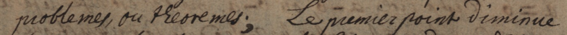
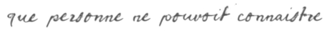
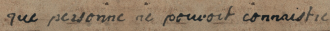
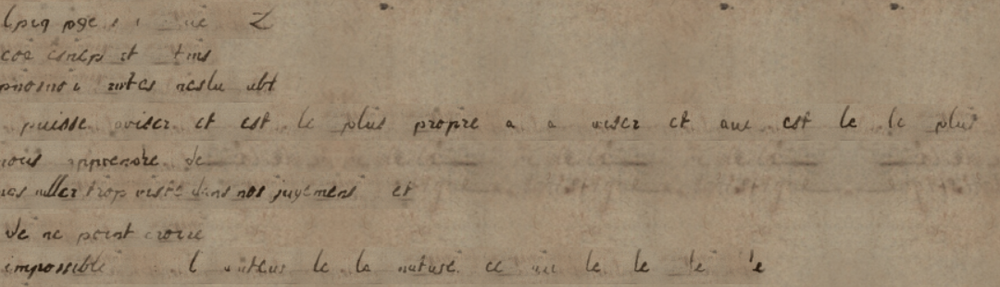

On cherche à générer des pages synthétiques de manuscrits de Leibniz. Pourquoi ? Pour apprendre à le faire tout d'abord et ensuite pour aider au finetuning d'un modèle d'HTR. Initialement, on a souhaité se restreindre à des GAN, les modèles de diffusion étant trop intensifs en calcul (ou alors l'installation ne se passait pas comme prévu voire tout simplement le code ne fonctionnait pas). Finalement, un tout petit modèle comme [Emuru](https://huggingface.co/blowing-up-groundhogs/emuru) (_T5-based decoder with a Variational Autoencoder_; 0.7B) permet d'obtenir des résultats déjà intéressants (si on pense à appliquer ultérieurement de la petite géométrie pour dégrader, reformater, transformer l'image générée afin de la rendre plus réaliste, c'est-à-dire qu'elle colle plus à ce que l'on peut effectivement observer dans les manuscrits de Leibniz).

C'est un modèle prenant en entrée une ligne stylisée accompagnée de sa transcription ainsi que le texte que l'on souhaite voir écrit selon le style manuscrit fourni. En sortie, on obtient donc une image. Pour les premiers tests de ce modèle, on s'est borné à extraire des XML Pages toutes les lignes afin d'avoir une correspondance texte <-> bounding box. Il suffisait alors de fournir au modèle le texte que l'on souhaitait voir générer. Pour cela, comme on cherche à générer des données non précédemment vues, on a récupéré des échantillons textuels que l'on a ensuite mélangés (quitte à obtenir des textes ne voulant plus rien dire; certains résultats tendent à montrer que l'important n'est pas là, qui plus est, pour des modèles non sémantiques et "purement visuels", ce n'est pas un soucis).

En partant de la référence manuscrite suivante : 

en obtient la sortie brute, via Emuru, que voici :

Ce test présente plusieurs défauts (absence de fond, problèmes ductus...) conduisant à son criant manque de réalisme. Nous tenterons ultérieurement de court-circuiter le principe de génération "un exemple-une demande" du modèle afin d'obtenir de meilleurs résultats.

En appliquant quelques transformations géométriques, on parvient à obtenir un résultat faiblement plus réaliste (pour lequel certains problèmes à considérer sérieusement persistent) : 

Ce test a ensuite permis, en utilisant les échantillons textuels mélangés, d'obtenir un premier bout de page synthétique :

Le résultat reste relativement décevant mais laisse penser qu'il est possible d'en tirer quelque chose.

En faisant de la reconstruction ligne à ligne, on perd immédiatement quelques détails coucourant au réalisme de la page (par exemple le fait qu'un trait, une boucle ou queue de lettre puisse chevaucher la ligne en dessous). Est-ce à dire qu'il faut envisager de la reconstruction (bloc de) caractère(s) par (bloc de) caractère(s) ?

On a été en mesure d'améliorer légèrement les résultats. Toutefois, on pense qu'une approche ligne à ligne pour un modèle d'HTR pourrait suffire (en intégrant les points faisant défaut, discutés juste avant). Ce travail sera continué sous une autre perspective, au sein de l'équipe des manuscrits brûlés de l'ENC. (Bien évidemment, on ne compare pas l'état des manuscrits de Leibniz à ceux qui ont survécu à l'incendie de la Bibliothèque de Turin en 1904, par exemple. Disons seulement ici que les méthodes employées pourront être transférées.) De plus, on attend la sortie du modèle CVG
